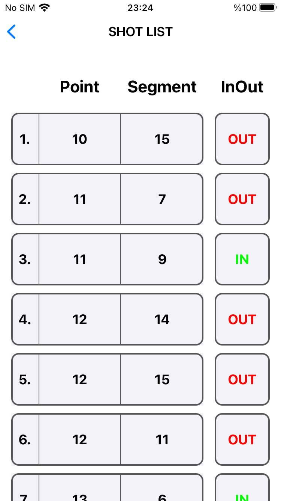
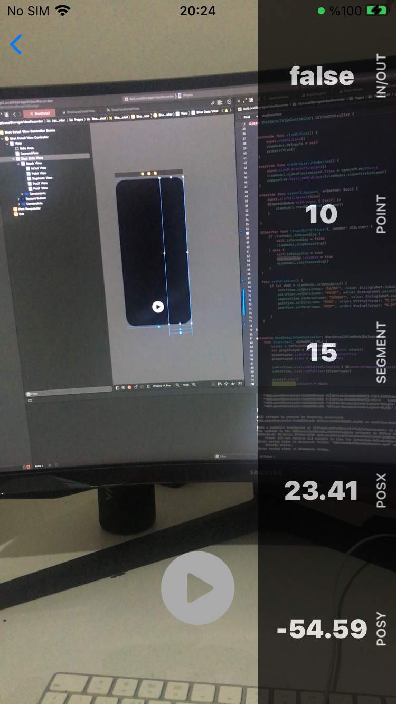

## Project Structure and Design Pattern
The project is organized into three main groups, implementing the MVVM (Model-View-ViewModel) design pattern. The groups are as follows:
- **Pages:** Contains Players, Shots and ShotDetail folders
  - **Players:** Contains PlayersViewController, PlayersViewModel and PlayersTableViewCell
  - **Shots:** Contains ShotsViewController, ShotsViewModel and ShotsTableViewCell
  - **ShotsDetail:** Contains ShotDetailViewController, ShotDetailViewModel and ShotDataDetailView
- **Model:** PlayerModel
- **Managers:** CoreDataManager, NetworkManager, PlayerManager, UpdatePlayerManager and VideoManager

## UNIT TESTS
PlayersViewModel and ShotsViewModel have been tested with two unit test files. In these tests, the following functions are tested using the provided mock data:
- `numberOfShots()`
- `getShot()`
- `getPlayer()`
- `numberOfPlayers()`
- `updateShots()`

## PlayersViewController & PlayersViewModel
PlayersViewController is responsible for displaying a list of players and their shot counts. It communicates with the CoreDataManager. If there is no player data stored in CoreData, the PlayerManager interacts with the NetworkManager to make a GET request to a specified address and saves the received data into CoreData. Then it populates the UITableViewCell elements with the Player's name, surname and shot count values.
 
 

 
 

## ShotsViewController & ShotsViewModel
ShotsViewController is connected to the TableView on the PlayersViewController page. When a cell is tapped, it navigates to the ShotsViewController page and displays the shot data for the selected player. The UITableViewCell elements are populated with the relevant shot information. Shots are sorted according to the shot's point value.   **Note:** If there are more than 2 shots with equal point values, the row order shown may changed.
 
 

 
 

## ShotDetailViewController & ShotDetailViewModel
ShotDetailViewModel initializes the camera setup using AVFoundation in the `init()` method. In the `viewWillAppear()` method, the `checkForExistingVideo()` function is called. This function checks if a file with the same "id" value as the shot exists in the device folder using the VideoManager and FileManager. If a file is found, the `playVideo(_ videoURL: URL)` method is called. This method automatically starts playing the previously saved video and displays the shot parameters on the screen using custom views called "ShotDataDetailView". When the "Play" button is pressed, the "ShotDataDetailView" is hidden, and the recording process begins. When the "Pause" button is pressed, the recorded video is saved to the device using FileManager with the shot's ID value. The cameraView sublayers are removed, and then adding subLayer the playerLayer to automatic playback for the saved video.
 
 

 
 

## Local Storage
To be able to use the app offline, app using CoreData. Recorded videos are stored to device's folder by using FileManager

## Network Connection
Contains GET method by using URLSession

## Video
AVFoundation is used for the video parts
